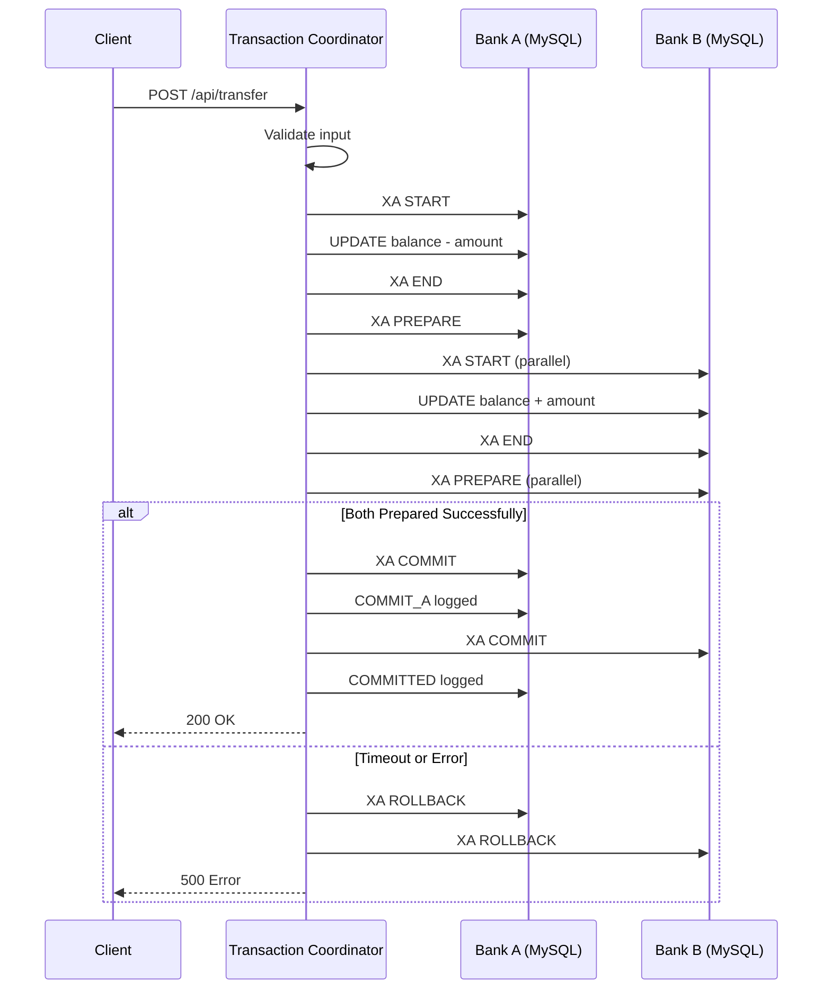

# V-Bank 2PC — System Architecture

> **Phiên bản:** 1.0
> **Ngày:** 17/03/2026

---

## 1. High-Level Architecture

```
┌─────────────────────────────────────────────────────────────────────────────┐
│                              CLIENT LAYER                                   │
│  ┌─────────────────────────────────────────────────────────────────────┐   │
│  │                    Browser (HTML/CSS/JS)                           │   │
│  │              Port 5500 (Live Server) / File://                    │   │
│  └─────────────────────────────────────────────────────────────────────┘   │
└──────────────────────────────────┬────────────────────────────────────────┘
                                   │ HTTP/REST
                                   ▼
┌─────────────────────────────────────────────────────────────────────────────┐
│                          APPLICATION LAYER                                   │
│  ┌─────────────────────────────────────────────────────────────────────┐   │
│  │              Flask Server (Transaction Coordinator)                │   │
│  │                       Port 5000                                     │   │
│  │  ┌─────────────┐ ┌─────────────┐ ┌─────────────┐ ┌────────────┐  │   │
│  │  │   Routes    │ │   2PC Core  │ │  Account    │ │  Database  │  │   │
│  │  │   Layer     │ │   Logic     │ │  Service    │ │  Helpers   │  │   │
│  │  └─────────────┘ └─────────────┘ └─────────────┘ └────────────┘  │   │
│  └─────────────────────────────────────────────────────────────────────┘   │
└──────────────┬────────────────────────────┬─────────────────────────────────┘
               │                            │
               │ XA Transaction             │ XA Transaction
               ▼                            ▼
┌──────────────────────────────┐   ┌──────────────────────────────┐
│        BANK A                │   │        BANK B                │
│   ┌────────────────────┐    │   │   ┌────────────────────┐     │
│   │   MySQL Container  │    │   │   │   MySQL Container  │     │
│   │   Port: 5433       │    │   │   │   Port: 5434       │     │
│   │   Database: bank1  │    │   │   │   Database: bank2 │     │
│   └────────────────────┘    │   │   └────────────────────┘     │
│                             │   │                                │
│   Tables:                   │   │   Tables:                     │
│   - accounts               │   │   - accounts                  │
│   - transactions          │   │   - transactions              │
│   - transaction_log       │   │                                │
└─────────────────────────────┘   └────────────────────────────────┘
```

---

## 2. Component Architecture

### 2.1. Component Diagram

```
┌─────────────────────────────────────────────────────────────────────────────┐
│                              FLASK APP                                      │
├─────────────────────────────────────────────────────────────────────────────┤
│                                                                             │
│  ┌──────────────────────────────────────────────────────────────────────┐  │
│  │                        ROUTES LAYER                                   │  │
│  │  ┌──────────┐  ┌──────────┐  ┌──────────┐  ┌──────────┐          │  │
│  │  │  /login  │  │/accounts │  │/transfer │  │/recover  │          │  │
│  │  └────┬─────┘  └────┬─────┘  └────┬─────┘  └────┬─────┘          │  │
│  └───────┼─────────────┼─────────────┼─────────────┼─────────────────┘  │
│          │             │             │             │                      │
│          ▼             ▼             ▼             ▼                      │
│  ┌──────────────────────────────────────────────────────────────────────┐  │
│  │                      SERVICE LAYER                                    │  │
│  │  ┌────────────────┐  ┌────────────────┐  ┌────────────────────┐  │  │
│  │  │AccountService  │  │TwoPhaseCommit  │  │   Logger            │  │  │
│  │  │- authenticate  │  │- execute       │  │   - log_phase       │  │  │
│  │  │- find_account  │  │- recover       │  │   - get_logger     │  │  │
│  │  │- save_tx       │  │- compensate    │  │                    │  │  │
│  │  └───────┬────────┘  └───────┬────────┘  └────────────────────┘  │  │
│  └──────────┼───────────────────┼──────────────────────────────────────┘  │
│             │                    │                                          │
│             ▼                    ▼                                          │
│  ┌──────────────────────────────────────────────────────────────────────┐  │
│  │                    DATABASE LAYER                                     │  │
│  │  ┌────────────────┐  ┌────────────────┐  ┌────────────────────────┐ │  │
│  │  │   DB1 (Bank A) │  │   DB2 (Bank B) │  │  Connection Pool       │ │  │
│  │  │   XA PREPARE  │  │   XA PREPARE  │  │  - get_connection     │ │  │
│  │  │   XA COMMIT   │  │   XA COMMIT   │  │  - execute_query      │ │  │
│  │  │   XA ROLLBACK │  │   XA ROLLBACK │  │                       │ │  │
│  │  └────────────────┘  └────────────────┘  └────────────────────────┘ │  │
│  └──────────────────────────────────────────────────────────────────────┘  │
│                                                                             │
└─────────────────────────────────────────────────────────────────────────────┘
```

---

## 3. Module Descriptions

### 3.1. Backend Package Structure

```
backend/
├── __init__.py           # Package marker, version info
├── app.py                # Flask entry point, route registration
├── config.py             # DB configs, constants, phase labels
├── logger.py             # Centralized logging configuration
├── database.py           # DB connection helpers, query utilities
├── account_service.py    # Account operations (auth, lookup, save)
├── two_phase_commit.py   # 2PC logic, XA operations, recovery
└── routes/
    ├── __init__.py       # Blueprint registration
    ├── auth.py           # /api/login
    ├── accounts.py       # /api/accounts, /api/lookup-account
    ├── transfer.py       # /api/transfer
    └── recovery.py       # /api/recover
```

### 3.2. Module Responsibilities

| Module | Responsibility | Public API |
|--------|----------------|------------|
| `config.py` | Cấu hình DB, constants | `DB1_CONFIG`, `DB2_CONFIG`, `PREPARE_TIMEOUT`, `PHASE_LABELS` |
| `logger.py` | Logging tập trung | `get_logger(name)` |
| `database.py` | DB connection, query helpers | `get_connection()`, `get_log_conn()`, `execute_query()` |
| `account_service.py` | Tìm kiếm, xác thực tài khoản | `authenticate_user()`, `find_account_by_number()`, `save_transaction()` |
| `two_phase_commit.py` | Logic 2PC, recovery, compensation | `execute_transfer()`, `recover_in_doubt_transactions()`, `do_compensation()` |
| `routes/*.py` | HTTP endpoints | Flask blueprints |

---

## 4. Data Flow

### 4.1. Transfer Flow (Happy Path)

```
┌─────────┐     ┌─────────────┐     ┌────────────────┐     ┌─────────────┐
│Frontend │────▶│ /api/transfer│────▶│ find_account   │────▶│ 2PC Execute │
└─────────┘     └─────────────┘     └────────────────┘     └──────┬──────┘
                                                                    │
                                              ┌─────────────────────┼───────┐
                                              │                     │       │
                                              ▼                     ▼       ▼
                                                              ┌─────────┐  ┌─────────┐
                                                              │  DB1    │  │  DB2    │
                                                              │PREPARE │  │PREPARE │
                                                              └────┬────┘  └────┬────┘
                                                                   │            │
                                              ┌─────────────────────┼────────────┤
                                              │                     ▼            │
                                              │              ┌─────────┐  ┌──────┘
                                              │              │  DB1    │
                                              │              │ COMMIT  │
                                              │              └────┬────┘
                                              │                   │
                                              │              ┌────┴────┐
                                              │              │         │
                                              ▼              ▼         ▼
                                                              ┌─────────┐  ┌─────────┐
                                                              │  DB2    │  │ Response│
                                                              │ COMMIT  │─▶│  Client │
                                                              └─────────┘  └─────────┘
```

### 4.2. Sequence Diagram



---

## 5. Infrastructure

### 5.1. Docker Services

| Service | Image | Port | Database | Purpose |
|---------|-------|------|----------|---------|
| `mysql1` | mysql:8 | 5433 | bank1 | Bank A |
| `mysql2` | mysql:8 | 5434 | bank2 | Bank B |
| `mysql3` | mysql:8 | 5435 | bank3 | Bank C (mở rộng) |

### 5.2. Network Configuration

```yaml
# docker-compose.yml network
networks:
  default:
    driver: bridge
    name: vbank-network
```

---

## 6. Security Architecture

### 6.1. Authentication Flow

```
┌──────────┐     ┌─────────────┐     ┌────────────────┐     ┌──────────┐
│  User    │────▶│  Frontend   │────▶│  /api/login    │────▶│  DB1/DB2 │
│  Input   │     │  (JS)       │     │  (Flask)       │     │  (MySQL) │
└──────────┘     └─────────────┘     └────────────────┘     └──────────┘
                                                                   │
                                              MD5(password) ─────┘
```

### 6.2. CORS Configuration

```python
# backend/app.py
CORS(app)  # Allow all origins for development
```

---

## 7. Scalability Considerations

### 7.1. Current Limitations

| Area | Current | Future Enhancement |
|------|---------|-------------------|
| **DB Connection** | Per-request creation | Connection pooling |
| **Horizontal Scaling** | Single TC instance | Multiple TC with load balancer |
| **3+ Banks** | 2 banks | Sharding/partitioning |

### 7.2. Extension Points

- **Add Bank C:** Thêm config vào `ALL_DB_CONFIGS`
- **Add Transaction Types:** Mở rộng `execute_transfer()` → `execute_transaction(type, ...)`
- **Audit Trail:** Mở rộng `transaction_log` với JSON payload

---

## 8. Deployment Architecture

```
┌─────────────────────────────────────────────────────────────────────────┐
│                           PRODUCTION                                     │
│                                                                          │
│  ┌─────────────┐    ┌─────────────┐    ┌─────────────┐                  │
│  │   Nginx     │───▶│   Flask     │───▶│   MySQL     │                  │
│  │  (Reverse   │    │   (Gunicorn)│    │  Cluster    │                  │
│  │   Proxy)    │    │             │    │             │                  │
│  └─────────────┘    └─────────────┘    └─────────────┘                  │
│         │                  │                   │                         │
│         └──────────────────┴───────────────────┘                         │
│                      Docker Compose / K8s                                │
└─────────────────────────────────────────────────────────────────────────┘
```

---

## 9. Monitoring & Observability

### 9.1. Logging Strategy

| Log Type | Destination | Content |
|----------|-------------|---------|
| **Phase Log** | `.log` file + `transaction_log` DB | Chi tiết từng phase 2PC |
| **Error Log** | `.log` file | Exception stack trace |
| **Access Log** | Flask default | HTTP request/response |

### 9.2. Key Metrics

- Transaction success/failure rate
- Average response time per phase
- Recovery frequency
- Timeout occurrences

---

## 10. Related Documentation

- [PRD](./PRD.md) - Product Requirements
- [API](./API.md) - API Documentation
- [2PC Protocol](./2PC-PROTOCOL.md) - Two-Phase Commit Details
- [Error Handling](./ERROR-HANDLING.md) - Error Scenarios & Recovery
- [Database](./DATABASE.md) - Database Schema
